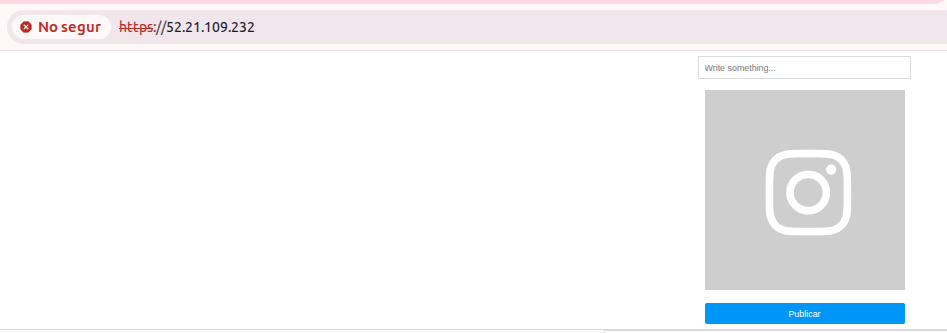

# Configuracion del servicio Apache
---

Una vez instalado el servicio añadimos los archivos de php,los cuales nos ha proporcionado el profesorado

**extagram.php**
```bash
<!DOCTYPE html>
<html>
<head>
    <title>Extagram</title>
    <link rel="stylesheet" href="style.css">
</head>
<body>
    <form method="POST" enctype="multipart/form-data" action="upload.php">
        <input type="text" name="post" placeholder="Write something...">
        <input id="file" type="file" name="photo" onchange="document.getElementById('preview').src=window.URL.createObjectURL(event.target.files[0])">
        <label for="file">
             
        </label>
        <input type="submit" value="Publicar">
    </form>

    <?php
    require_once 'db_config.php';
    
    $db = new mysqli($servername, $username, $password, $dbname); 

    if ($db->connect_error) {
        die("Connection failed: " . $db->connect_error);
    }

    foreach ($db->query("SELECT * FROM posts") as $fila) {
        echo "<div class='post'>";
        echo "<p>".$fila['post']."</p>";
        if (!empty($fila['photourl'])) {
            echo "";
        }
        echo "</div>";
    }
    ?>
</body>
</html>
```
Comentario del codigo:
  
---

**upload.php**
```bash
<?php
if (!empty($_POST["post"])) {
        require_once 'db_config.php';
        $db = new mysqli($servername, $username, $password, $dbname);;
        $photoid;
        if(!empty($_FILES['photo']['name'])){
        $photoid = uniqid();
        move_uploaded_file($_FILES['photo']['tmp_name'], 'uploads/' . $photoid);
        }

        $stmt = $db->prepare("INSERT INTO posts VALUES(?,?)");
        $stmt->bind_param("ss", $_POST["post"], $photoid);
        $stmt->execute();
        $stmt->close();
}
 
header("location: /");
?>
```
Comentario del codigo:
  Script de procesamiento de formularios que maneja subida de imágenes y inserción en BD.

---

**style.css**
```bash
body {
        background: #fafafa;
        font-family: sans;
        margin: 0;
}
 form {
        display: flex;
        flex-direction: column;
        justify-content: center;
        align-items: center;
        gap: 1em;
        background: white;
        border-bottom: 1px solid #dbdbdb;
        padding: 8px;
}
 input[type=text] {
        border: 1px solid #dbdbdb;
        padding: 8px;
        width: 300px;
} 
input[type=submit] {
        background: #0096f7;
        color: white;
        border: 0;
        border-radius: 3px;
        width: 300px;
        padding: 8px;
} 
#file { display: none; }
 
#preview { max-width: 300px; }
 
.post {
        max-width: 600px;
        margin: 0 auto;
        background: white;
        display: flex;
        flex-direction: column;
        border: 1px solid #dbdbdb;
        border-radius: 3px;
        margin-bottom: 24px;
}
 
.post img { max-width: 600px; }
 
.post p { padding: 16px; }
```
Comentario del codigo:
  CSS moderno con Flexbox que replica estéticamente Instagram

---
  
**preview.svg**
```bash
<?xml version="1.0" encoding="UTF-8"?>
<svg version="1.1" xmlns="http://www.w3.org/2000/svg" viewBox="0 0 100 100" width="300" height="300">
<g>
<rect width="100" height="100" fill="#cecece"/>
<path fill="#ffffff" transform="translate(25 25)" d="M48.1,26.3c0,4.3,0,7.2-0.1,8.8c-0.2,3.9-1.3,6.9-3.5,9s-5.1,3.3-9,3.5c-1.6,0.1-4.6,0.1-8.8,0.1c-4.3,0-7.2,0-8.8-0.1   c-3.9-0.2-6.9-1.3-9-3.5c-2.1-2.1-3.3-5.1-3.5-9c-0.1-1.6-0.1-4.6-0.1-8.8s0-7.2,0.1-8.8c0.2-3.9,1.3-6.9,3.5-9   c2.1-2.1,5.1-3.3,9-3.5c1.6-0.1,4.6-0.1,8.8-0.1c4.3,0,7.2,0,8.8,0.1c3.9,0.2,6.9,1.3,9,3.5s3.3,5.1,3.5,9   C48,19.1,48.1,22,48.1,26.3z M28.8,8.7c-1.3,0-2,0-2.1,0c-0.1,0-0.8,0-2.1,0c-1.3,0-2.3,0-2.9,0c-0.7,0-1.6,0-2.7,0.1   c-1.1,0-2.1,0.1-2.9,0.3c-0.8,0.1-1.5,0.3-2,0.5c-0.9,0.4-1.7,0.9-2.5,1.6c-0.7,0.7-1.2,1.5-1.6,2.5c-0.2,0.5-0.4,1.2-0.5,2   s-0.2,1.7-0.3,2.9c0,1.1-0.1,2-0.1,2.7c0,0.7,0,1.7,0,2.9c0,1.3,0,2,0,2.1s0,0.8,0,2.1c0,1.3,0,2.3,0,2.9c0,0.7,0,1.6,0.1,2.7   c0,1.1,0.1,2.1,0.3,2.9s0.3,1.5,0.5,2c0.4,0.9,0.9,1.7,1.6,2.5c0.7,0.7,1.5,1.2,2.5,1.6c0.5,0.2,1.2,0.4,2,0.5   c0.8,0.1,1.7,0.2,2.9,0.3s2,0.1,2.7,0.1c0.7,0,1.7,0,2.9,0c1.3,0,2,0,2.1,0c0.1,0,0.8,0,2.1,0c1.3,0,2.3,0,2.9,0   c0.7,0,1.6,0,2.7-0.1c1.1,0,2.1-0.1,2.9-0.3c0.8-0.1,1.5-0.3,2-0.5c0.9-0.4,1.7-0.9,2.5-1.6c0.7-0.7,1.2-1.5,1.6-2.5   c0.2-0.5,0.4-1.2,0.5-2c0.1-0.8,0.2-1.7,0.3-2.9c0-1.1,0.1-2,0.1-2.7c0-0.7,0-1.7,0-2.9c0-1.3,0-2,0-2.1s0-0.8,0-2.1   c0-1.3,0-2.3,0-2.9c0-0.7,0-1.6-0.1-2.7c0-1.1-0.1-2.1-0.3-2.9c-0.1-0.8-0.3-1.5-0.5-2c-0.4-0.9-0.9-1.7-1.6-2.5   c-0.7-0.7-1.5-1.2-2.5-1.6c-0.5-0.2-1.2-0.4-2-0.5c-0.8-0.1-1.7-0.2-2.9-0.3c-1.1,0-2-0.1-2.7-0.1C31.1,8.7,30.1,8.7,28.8,8.7z  M34.4,18.5c2.1,2.1,3.2,4.7,3.2,7.8s-1.1,5.6-3.2,7.8c-2.1,2.1-4.7,3.2-7.8,3.2c-3.1,0-5.6-1.1-7.8-3.2c-2.1-2.1-3.2-4.7-3.2-7.8   s1.1-5.6,3.2-7.8c2.1-2.1,4.7-3.2,7.8-3.2C29.7,15.3,32.3,16.3,34.4,18.5z M31.7,31.3c1.4-1.4,2.1-3.1,2.1-5s-0.7-3.7-2.1-5.1   c-1.4-1.4-3.1-2.1-5.1-2.1c-2,0-3.7,0.7-5.1,2.1s-2.1,3.1-2.1,5.1s0.7,3.7,2.1,5c1.4,1.4,3.1,2.1,5.1,2.1   C28.6,33.4,30.3,32.7,31.7,31.3z M39.9,13c0.5,0.5,0.8,1.1,0.8,1.8c0,0.7-0.3,1.3-0.8,1.8c-0.5,0.5-1.1,0.8-1.8,0.8   s-1.3-0.3-1.8-0.8c-0.5-0.5-0.8-1.1-0.8-1.8c0-0.7,0.3-1.3,0.8-1.8c0.5-0.5,1.1-0.8,1.8-0.8S39.4,12.5,39.9,13z"/>
</g>
</svg>
```
Comentario del codigo:
  Icono SVG inline de cámara bien optimizado (100x100 viewBox escalable)

---

**db_config.php**

```bash
<?php
$servername = "localhost";
$username = "extagram_admin";
$password = "P0.1_G04";
$dbname = "extagram_db";
?>
```

Para que el apache identifique el extagram.php como archivo index deberemos de añadir al archivo de nuestra pagina web (vhost)

```bash
DirectoryIndex extagram.php
```
## Configuración certificados ssl (https)


### Activación de HTTPS con certificado autofirmado

Primero generé un certificado SSL autofirmado para Apache usando OpenSSL, creando la clave privada y el certificado en las rutas estándar del sistema:

```bash
sudo openssl req -x509 -nodes -days 365 -newkey rsa:2048 \
  -keyout /etc/ssl/private/clavessh.key \
  -out /etc/ssl/certs/clavessh.crt
```

Después habilité el módulo SSL y el sitio HTTPS por defecto:

```bash
sudo a2enmod ssl
sudo a2ensite default-ssl.conf
sudo systemctl reload apache2
```

En el `default-ssl.conf` configuré Apache para usar estos ficheros al atender peticiones HTTPS en el puerto 443:

```apache
<VirtualHost _default_:443>
    ServerName webmaster@localhost
	DirectoryIndex extagram.php
    DocumentRoot /var/www/html

    SSLEngine on
    SSLCertificateFile /etc/ssl/certs/clavessh.crt
    SSLCertificateKeyFile /etc/ssl/private/clavessh.key
</VirtualHost>
```

### Redirección de HTTP a HTTPS

Para que todo el tráfico vaya siempre cifrado, añadí una redirección permanente en el VirtualHost del puerto 80:[web:19][web:22]

```apache
<VirtualHost *:80>
    ServerName webmaster@localhost
	DirectoryIndex extagram.php
    DocumentRoot /var/www/html

    # Redirigir todo HTTP a HTTPS
    RewriteEngine On
    RewriteCond %{HTTPS} off
    RewriteRule ^(.*)$ https://%{HTTP_HOST}%{REQUEST_URI} [L,R=301]	

</VirtualHost>
```

Finalmente comprobé la configuración y recargué Apache:[web:23]

```bash
sudo apachectl -t
sudo systemctl reload apache2
```

### Ventajas de usar HTTPS y redirección

Configurar HTTPS con certificado (aunque sea autofirmado) permite cifrar el tráfico entre cliente y servidor, evitando que credenciales y datos sensibles viajen en texto claro por la red. Además, garantiza la integridad de las respuestas, reduciendo el riesgo de manipulaciones o inyecciones de contenido por atacantes intermedios.

Al forzar la redirección de HTTP a HTTPS se asegura que todos los usuarios utilicen siempre la conexión cifrada, incluso si escriben o tienen guardado el enlace con `http://` Esto unifica el acceso al sitio, evita versiones inseguras de la página y mejora la percepción de seguridad al mostrar el candado en el navegador.

<div align="center">
  

</div>
