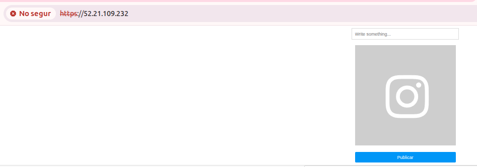

# Configuracion del servicio Apache
---

Una vez instalado el servicio añadimos los archivos de php,los cuales nos ha proporcionado el profesorado

**extagram.php**
```bash
<!DOCTYPE html>
<html lang="es">
<head>
    <meta charset="UTF-8">
    <meta name="viewport" content="width=device-width, initial-scale=1.0">
    <title>Extagram | Dashboard</title>
    <link rel="stylesheet" href="https://cdnjs.cloudflare.com/ajax/libs/font-awesome/6.0.0/css/all.min.css">
    <style>
        :root {
            --header-bg: #1F2937;
            --body-bg: #F3F4F6;
            --card-bg: #FFFFFF;
            --text-main: #374151;
            --primary: #4F46E5;
        }
        
        /* SOLUCIÓN STICKY FOOTER FLEXBOX */
        body { 
            margin: 0; 
            padding: 0; 
            font-family: 'Inter', 'Segoe UI', sans-serif; 
            background: var(--body-bg); 
            color: var(--text-main); 
            -webkit-font-smoothing: antialiased;
            
            /* La magia para el footer abajo: */
            display: flex;
            flex-direction: column;
            min-height: 100vh; 
        }
        
        /* Navbar */
        .navbar { background: var(--header-bg); color: white; height: 64px; display: flex; align-items: center; justify-content: space-between; padding: 0 5%; box-shadow: 0 4px 6px -1px rgba(0,0,0,0.1); position: sticky; top: 0; z-index: 50; flex-shrink: 0; }
        .brand { font-size: 18px; font-weight: 700; letter-spacing: 0.5px; display: flex; align-items: center; gap: 10px; color: white; text-decoration: none;}
        
        .upload-btn-nav { background: var(--primary); color: white; text-decoration: none; padding: 8px 16px; border-radius: 6px; font-size: 14px; font-weight: 500; transition: 0.2s; display: flex; align-items: center; gap: 8px; }
        .upload-btn-nav:hover { background: #4338ca; transform: translateY(-1px); }

        /* Controles */
        .toolbar { padding: 30px 5% 20px 5%; display: flex; justify-content: space-between; align-items: center; flex-shrink: 0; }
        .toolbar h3 { margin: 0; font-weight: 600; color: #111827; font-size: 20px; }
        
        .view-toggles { background: white; border: 1px solid #E5E7EB; border-radius: 6px; overflow: hidden; display: flex; }
        .view-toggles button { background: white; border: none; padding: 8px 14px; cursor: pointer; color: #6B7280; border-right: 1px solid #E5E7EB; transition: 0.2s; }
        .view-toggles button:last-child { border-right: none; }
        .view-toggles button:hover { background: #F9FAFB; }
        .view-toggles button.active { background: #EEF2FF; color: var(--primary); }

        /* Contenedor Principal con FLEX-GROW */
        .container { 
            padding: 0 5% 40px 5%; 
            flex: 1; /* Esto empuja el footer hacia abajo */
            width: 90%; /* Asegura consistencia en anchos */
            max-width: 1400px;
            margin: 0 auto;
        }
        
        /* --- ESTILOS DE TARJETAS --- */
        .card { background: var(--card-bg); border-radius: 12px; overflow: hidden; box-shadow: 0 1px 3px 0 rgba(0,0,0,0.1), 0 1px 2px 0 rgba(0,0,0,0.06); border: 1px solid #E5E7EB; transition: all 0.3s ease; }
        .card:hover { box-shadow: 0 10px 15px -3px rgba(0,0,0,0.1); transform: translateY(-2px); border-color: #D1D5DB; }
        
        .card-img-container { 
            background: #E5E7EB; 
            position: relative; 
            overflow: hidden;
        }
        
        .post-img { width: 100%; height: 100%; object-fit: cover; transition: transform 0.5s; }
        .card:hover .post-img { transform: scale(1.03); }
        
        /* Badges */
        .badge { font-size: 10px; font-weight: 700; padding: 4px 8px; border-radius: 4px; position: absolute; top: 12px; right: 12px; z-index: 10; text-transform: uppercase; letter-spacing: 0.5px; box-shadow: 0 2px 4px rgba(0,0,0,0.1); }
        .bg-success { background: rgba(16, 185, 129, 0.9); color: white; backdrop-filter: blur(2px); }
        .bg-danger { background: rgba(239, 68, 68, 0.9); color: white; backdrop-filter: blur(2px); }

        .card-body { padding: 20px; }
        .meta { font-size: 12px; color: #9CA3AF; margin-top: 12px; display: flex; align-items: center; gap: 5px; }

        /* --- VISTA GRID --- */
        .layout-grid { display: grid; grid-template-columns: repeat(auto-fill, minmax(280px, 1fr)); gap: 25px; }
        .layout-grid .card-img-container { width: 100%; aspect-ratio: 1 / 1; }
        
        /* --- VISTA LIST --- */
        .layout-list { display: flex; flex-direction: column; gap: 20px; max-width: 800px; margin: 0 auto; }
        .layout-list .card { display: flex; flex-direction: row; align-items: stretch; height: 220px; }
        .layout-list .card-img-container { width: 220px; min-width: 220px; height: 100%; }
        .layout-list .card-body { flex-grow: 1; display: flex; flex-direction: column; justify-content: center; overflow: hidden; }

        @media (max-width: 600px) {
            .layout-list .card { flex-direction: column; height: auto; }
            .layout-list .card-img-container { width: 100%; height: 250px; }
        }

        /* Footer */
        .footer-status { 
            flex-shrink: 0; /* Evita que se encoja */
            text-align: center; 
            font-size: 12px; 
            color: #9CA3AF; 
            padding: 30px; 
            border-top: 1px solid #E5E7EB; 
            background: white; 
        }
        .server-id { font-family: 'Courier New', monospace; background: #F3F4F6; padding: 2px 6px; border-radius: 4px; color: var(--primary); font-weight: bold;}
    </style>
</head>
<body>

    <nav class="navbar">
        <a href="index.php" class="brand">
            <i class="fas fa-cubes"></i> EXTAGRAM PRO
        </a>
        <a href="upload.php" class="upload-btn-nav">
            <i class="fas fa-plus"></i> <span style="margin-left:5px">Nueva Foto</span>
        </a>
    </nav>

    <div class="toolbar">
        <h3>Activos Recientes</h3>
        <div class="view-toggles">
            <button onclick="setView('grid')" id="btn-grid" class="active"><i class="fas fa-th-large"></i></button>
            <button onclick="setView('list')" id="btn-list"><i class="fas fa-list"></i></button>
        </div>
    </div>

    <div class="container">
        <div id="posts-container" class="layout-grid">
            <?php
            ini_set('display_errors', 0);
            include 'db.php';
            $server_id = gethostname();

            $sql = "SELECT * FROM posts ORDER BY created_at DESC";
            $result = $conn->query($sql);

            if ($result && $result->num_rows > 0) {
                while($row = $result->fetch_assoc()) {
                    $ruta_fisica = "uploads/" . $row["photourl"];
                    $source_badge = "";
                    $img_src = "";

                    if (!empty($row["photourl"]) && file_exists($ruta_fisica)) {
                        $source_badge = "<span class='badge bg-success'><i class='fas fa-hdd'></i> DISK (S5)</span>";
                        $img_src = "/uploads/" . $row["photourl"];
                    } elseif (!empty($row["image_blob"])) {
                        $source_badge = "<span class='badge bg-danger'><i class='fas fa-database'></i> BLOB (S7)</span>";
                        $img_src = 'data:image/jpeg;base64,'.base64_encode($row['image_blob']);
                    } else {
                        $img_src = "https://via.placeholder.com/300?text=Error";
                    }
                    
                    $post_text = htmlspecialchars($row["post"] ?? '');

                    echo "
                    <article class='card'>
                        <div class='card-img-container'>
                            $source_badge
                            
                        </div>
                        <div class='card-body'>
                            <div style='font-size:12px; font-weight:700; color:#9CA3AF; margin-bottom:5px; text-transform:uppercase;'>ID #{$row['id']}</div>
                            <div style='color:#374151; line-height:1.6; font-size:15px;'>$post_text</div>
                            <div class='meta'>
                                <i class='far fa-clock'></i> " . date("d M Y • H:i", strtotime($row["created_at"])) . "
                            </div>
                        </div>
                    </article>
                    ";
                }
            } else {
                echo "
                <div style='grid-column: 1/-1; display:flex; flex-direction:column; align-items:center; justify-content:center; height:100%; min-height:300px; color:#9CA3AF;'>
                    <i class='fas fa-camera' style='font-size:48px; margin-bottom:20px; color:#D1D5DB;'></i>
                    <div style='font-size:18px; font-weight:500;'>No hay contenido aún</div>
                    <div style='font-size:14px; margin-top:5px;'>Sé el primero en subir algo</div>
                </div>";
            }
            ?>
        </div>
    </div>

    <div class="footer-status">
        Served by Node: <span class="server-id"><?php echo $server_id; ?></span> &bull; Status: <span style="color:#10B981">Operational</span>
    </div>

    <script>
        function setView(view) {
            const container = document.getElementById('posts-container');
            const btnGrid = document.getElementById('btn-grid');
            const btnList = document.getElementById('btn-list');

            if (view === 'list') {
                container.className = 'layout-list';
                btnList.classList.add('active');
                btnGrid.classList.remove('active');
            } else {
                container.className = 'layout-grid';
                btnGrid.classList.add('active');
                btnList.classList.remove('active');
            }
            localStorage.setItem('extagram_view', view);
        }

        if (localStorage.getItem('extagram_view') === 'list') {
            setView('list');
        }
    </script>
</body>
</html>
```
Comentario del codigo:
  
---

**upload.php**
```bash
<?php
ob_start();
ini_set('display_errors', 0);
ini_set('upload_max_filesize', '50M');
ini_set('post_max_size', '50M');

include 'db.php';

$msg = "";
$msg_type = ""; 

if ($_SERVER["REQUEST_METHOD"] == "POST") {
    $texto = $_POST['texto'] ?? '';
    
    if (isset($_FILES['imagen']) && $_FILES['imagen']['error'] == 0) {
        $file_tmp = $_FILES["imagen"]["tmp_name"];
        $file_name = $_FILES["imagen"]["name"];
        $file_size = $_FILES["imagen"]["size"];
        
        // Validaciones PHP
        $finfo = finfo_open(FILEINFO_MIME_TYPE);
        $mime = finfo_file($finfo, $file_tmp);
        finfo_close($finfo);
        $allowed_mimes = ['image/jpeg', 'image/png', 'image/gif', 'image/webp'];
        
        if ($file_size > 50 * 1024 * 1024) {
            $msg = "El archivo es demasiado grande (>50MB)."; $msg_type = "error";
        } elseif (!in_array($mime, $allowed_mimes)) {
            $msg = "Formato no permitido."; $msg_type = "error";
        } else {
            // Procesamiento
            $ext = pathinfo($file_name, PATHINFO_EXTENSION);
            $nombre_seguro = "img_" . date("Ymd_His") . "_" . bin2hex(random_bytes(4)) . "." . $ext;
            $ruta_destino = "uploads/" . $nombre_seguro;
            $contenido_blob = file_get_contents($file_tmp);
            
            if (!file_exists('uploads')) mkdir('uploads', 0777, true);
            
            if (move_uploaded_file($file_tmp, $ruta_destino)) {
                try {
                    $stmt = $conn->prepare("INSERT INTO posts (post, photourl, image_blob) VALUES (?, ?, ?)");
                    $null = NULL;
                    $stmt->bind_param("ssb", $texto, $nombre_seguro, $null);
                    $stmt->send_long_data(2, $contenido_blob);
                    
                    if ($stmt->execute()) {
                        header("Location: index.php");
                        exit();
                    }
                } catch (Exception $e) {
                    $msg = "Error DB: " . $e->getMessage(); $msg_type = "error";
                }
            } else {
                $msg = "Error al guardar en disco."; $msg_type = "error";
            }
        }
    } else {
        $msg = "Por favor selecciona una imagen."; $msg_type = "error";
    }
}
?>
<!DOCTYPE html>
<html lang="es">
<head>
    <meta charset="UTF-8">
    <meta name="viewport" content="width=device-width, initial-scale=1.0">
    <title>Nueva Publicación | Extagram</title>
    <link rel="stylesheet" href="https://cdnjs.cloudflare.com/ajax/libs/font-awesome/6.0.0/css/all.min.css">
    <style>
        :root { --primary: #4F46E5; --primary-hover: #4338ca; --bg: #F3F4F6; --text: #1F2937; }
        body { font-family: 'Inter', system-ui, sans-serif; background-color: var(--bg); display: flex; align-items: center; justify-content: center; min-height: 100vh; margin: 0; padding: 20px; }
        
        .card { background: white; width: 100%; max-width: 480px; border-radius: 12px; box-shadow: 0 10px 25px rgba(0,0,0,0.05); overflow: hidden; }
        .card-header { background: white; padding: 20px 30px; border-bottom: 1px solid #E5E7EB; display: flex; align-items: center; justify-content: space-between; }
        .card-header h2 { margin: 0; font-size: 18px; color: var(--text); font-weight: 600; }
        
        .card-body { padding: 30px; }
        
        /* Input Styles */
        .form-group { margin-bottom: 20px; }
        label { display: block; font-size: 13px; font-weight: 600; color: #6B7280; margin-bottom: 8px; text-transform: uppercase; letter-spacing: 0.5px; }
        textarea { width: 100%; padding: 12px; border: 1px solid #D1D5DB; border-radius: 6px; font-size: 14px; transition: border 0.2s; box-sizing: border-box; min-height: 100px; resize: vertical; font-family: inherit;}
        textarea:focus { outline: none; border-color: var(--primary); ring: 2px solid rgba(79, 70, 229, 0.1); }
        
        /* Upload Area */
        .upload-area { border: 2px dashed #D1D5DB; border-radius: 8px; padding: 30px; text-align: center; cursor: pointer; transition: 0.2s; position: relative; }
        .upload-area:hover { border-color: var(--primary); background: #EEF2FF; }
        .upload-icon { font-size: 32px; color: #9CA3AF; margin-bottom: 10px; }
        .upload-text { color: #6B7280; font-size: 14px; }
        
        /* Preview Image */
        #preview-container { display: none; margin-top: 15px; position: relative; border-radius: 8px; overflow: hidden; border: 1px solid #E5E7EB; }
        #preview-img { width: 100%; display: block; max-height: 300px; object-fit: cover; }
        .remove-btn { position: absolute; top: 10px; right: 10px; background: rgba(0,0,0,0.6); color: white; border: none; width: 30px; height: 30px; border-radius: 50%; cursor: pointer; display: flex; align-items: center; justify-content: center; transition: 0.2s; }
        .remove-btn:hover { background: #DC2626; }

        /* Buttons */
        .btn { width: 100%; padding: 14px; background-color: var(--primary); color: white; border: none; border-radius: 6px; font-weight: 600; cursor: pointer; transition: all 0.2s; font-size: 15px; margin-top: 10px; }
        .btn:hover { background-color: var(--primary-hover); transform: translateY(-1px); }
        .cancel { text-align: center; display: block; margin-top: 15px; color: #6B7280; text-decoration: none; font-size: 14px; }
        .cancel:hover { color: var(--text); }

        .alert { padding: 12px; margin-bottom: 20px; border-radius: 6px; font-size: 14px; text-align: center; border-left: 4px solid; }
        .error { background-color: #FEF2F2; color: #991B1B; border-color: #DC2626; }
    </style>
</head>
<body>
    <div class="card">
        <div class="card-header">
            <h2><i class="fas fa-cloud-upload-alt"></i> Subir Contenido</h2>
            <a href="index.php" style="color:#9CA3AF"><i class="fas fa-times"></i></a>
        </div>
        <div class="card-body">
            <?php if($msg): ?>
                <div class="alert <?php echo $msg_type; ?>"><?php echo $msg; ?></div>
            <?php endif; ?>
            
            <form action="upload.php" method="post" enctype="multipart/form-data">
                <div class="form-group">
                    <label>Descripción</label>
                    <textarea name="texto" placeholder="Escribe algo interesante..." required></textarea>
                </div>
                
                <div class="form-group">
                    <label>Imagen</label>
                    
                    <input type="file" name="imagen" id="fileInput" accept="image/*" style="display:none" onchange="previewImage(this)">
                    
                    <div class="upload-area" id="uploadTrigger" onclick="document.getElementById('fileInput').click()">
                        <div class="upload-icon"><i class="fas fa-image"></i></div>
                        <div class="upload-text">Haz click para seleccionar una imagen</div>
                        <div style="font-size:11px; color:#9CA3AF; margin-top:5px;">JPG, PNG, WEBP (Máx 50MB)</div>
                    </div>

                    <div id="preview-container">
                        
                        <button type="button" class="remove-btn" onclick="removeImage()"><i class="fas fa-trash"></i></button>
                    </div>
                </div>
                
                <button type="submit" class="btn">Publicar ahora</button>
                <a href="index.php" class="cancel">Cancelar</a>
            </form>
        </div>
    </div>

    <script>
        function previewImage(input) {
            const previewContainer = document.getElementById('preview-container');
            const uploadTrigger = document.getElementById('uploadTrigger');
            const previewImg = document.getElementById('preview-img');
            
            if (input.files && input.files[0]) {
                const reader = new FileReader();
                reader.onload = function(e) {
                    previewImg.src = e.target.result;
                    previewContainer.style.display = 'block';
                    uploadTrigger.style.display = 'none'; // Ocultar zona de click
                }
                reader.readAsDataURL(input.files[0]);
            }
        }

        function removeImage() {
            const input = document.getElementById('fileInput');
            const previewContainer = document.getElementById('preview-container');
            const uploadTrigger = document.getElementById('uploadTrigger');
            
            input.value = ""; // Limpiar input real
            previewContainer.style.display = 'none';
            uploadTrigger.style.display = 'block'; // Volver a mostrar zona de click
        }
    </script>
</body>
</html>
<?php ob_end_flush(); ?>

```
Comentario del codigo:
  Script de procesamiento de formularios que maneja subida de imágenes y inserción en BD.

---

**style.css**
```bash
body {
        background: #fafafa;
        font-family: sans;
        margin: 0;
}
 form {
        display: flex;
        flex-direction: column;
        justify-content: center;
        align-items: center;
        gap: 1em;
        background: white;
        border-bottom: 1px solid #dbdbdb;
        padding: 8px;
}
 input[type=text] {
        border: 1px solid #dbdbdb;
        padding: 8px;
        width: 300px;
} 
input[type=submit] {
        background: #0096f7;
        color: white;
        border: 0;
        border-radius: 3px;
        width: 300px;
        padding: 8px;
} 
#file { display: none; }
 
#preview { max-width: 300px; }
 
.post {
        max-width: 600px;
        margin: 0 auto;
        background: white;
        display: flex;
        flex-direction: column;
        border: 1px solid #dbdbdb;
        border-radius: 3px;
        margin-bottom: 24px;
}
 
.post img { max-width: 600px; }
 
.post p { padding: 16px; }
```
Comentario del codigo:
  CSS moderno con Flexbox que replica estéticamente Instagram

---
  
**preview.svg**
```bash
<?xml version="1.0" encoding="UTF-8"?>
<svg version="1.1" xmlns="http://www.w3.org/2000/svg" viewBox="0 0 100 100" width="300" height="300">
<g>
<rect width="100" height="100" fill="#cecece"/>
<path fill="#ffffff" transform="translate(25 25)" d="M48.1,26.3c0,4.3,0,7.2-0.1,8.8c-0.2,3.9-1.3,6.9-3.5,9s-5.1,3.3-9,3.5c-1.6,0.1-4.6,0.1-8.8,0.1c-4.3,0-7.2,0-8.8-0.1   c-3.9-0.2-6.9-1.3-9-3.5c-2.1-2.1-3.3-5.1-3.5-9c-0.1-1.6-0.1-4.6-0.1-8.8s0-7.2,0.1-8.8c0.2-3.9,1.3-6.9,3.5-9   c2.1-2.1,5.1-3.3,9-3.5c1.6-0.1,4.6-0.1,8.8-0.1c4.3,0,7.2,0,8.8,0.1c3.9,0.2,6.9,1.3,9,3.5s3.3,5.1,3.5,9   C48,19.1,48.1,22,48.1,26.3z M28.8,8.7c-1.3,0-2,0-2.1,0c-0.1,0-0.8,0-2.1,0c-1.3,0-2.3,0-2.9,0c-0.7,0-1.6,0-2.7,0.1   c-1.1,0-2.1,0.1-2.9,0.3c-0.8,0.1-1.5,0.3-2,0.5c-0.9,0.4-1.7,0.9-2.5,1.6c-0.7,0.7-1.2,1.5-1.6,2.5c-0.2,0.5-0.4,1.2-0.5,2   s-0.2,1.7-0.3,2.9c0,1.1-0.1,2-0.1,2.7c0,0.7,0,1.7,0,2.9c0,1.3,0,2,0,2.1s0,0.8,0,2.1c0,1.3,0,2.3,0,2.9c0,0.7,0,1.6,0.1,2.7   c0,1.1,0.1,2.1,0.3,2.9s0.3,1.5,0.5,2c0.4,0.9,0.9,1.7,1.6,2.5c0.7,0.7,1.5,1.2,2.5,1.6c0.5,0.2,1.2,0.4,2,0.5   c0.8,0.1,1.7,0.2,2.9,0.3s2,0.1,2.7,0.1c0.7,0,1.7,0,2.9,0c1.3,0,2,0,2.1,0c0.1,0,0.8,0,2.1,0c1.3,0,2.3,0,2.9,0   c0.7,0,1.6,0,2.7-0.1c1.1,0,2.1-0.1,2.9-0.3c0.8-0.1,1.5-0.3,2-0.5c0.9-0.4,1.7-0.9,2.5-1.6c0.7-0.7,1.2-1.5,1.6-2.5   c0.2-0.5,0.4-1.2,0.5-2c0.1-0.8,0.2-1.7,0.3-2.9c0-1.1,0.1-2,0.1-2.7c0-0.7,0-1.7,0-2.9c0-1.3,0-2,0-2.1s0-0.8,0-2.1   c0-1.3,0-2.3,0-2.9c0-0.7,0-1.6-0.1-2.7c0-1.1-0.1-2.1-0.3-2.9c-0.1-0.8-0.3-1.5-0.5-2c-0.4-0.9-0.9-1.7-1.6-2.5   c-0.7-0.7-1.5-1.2-2.5-1.6c-0.5-0.2-1.2-0.4-2-0.5c-0.8-0.1-1.7-0.2-2.9-0.3c-1.1,0-2-0.1-2.7-0.1C31.1,8.7,30.1,8.7,28.8,8.7z  M34.4,18.5c2.1,2.1,3.2,4.7,3.2,7.8s-1.1,5.6-3.2,7.8c-2.1,2.1-4.7,3.2-7.8,3.2c-3.1,0-5.6-1.1-7.8-3.2c-2.1-2.1-3.2-4.7-3.2-7.8   s1.1-5.6,3.2-7.8c2.1-2.1,4.7-3.2,7.8-3.2C29.7,15.3,32.3,16.3,34.4,18.5z M31.7,31.3c1.4-1.4,2.1-3.1,2.1-5s-0.7-3.7-2.1-5.1   c-1.4-1.4-3.1-2.1-5.1-2.1c-2,0-3.7,0.7-5.1,2.1s-2.1,3.1-2.1,5.1s0.7,3.7,2.1,5c1.4,1.4,3.1,2.1,5.1,2.1   C28.6,33.4,30.3,32.7,31.7,31.3z M39.9,13c0.5,0.5,0.8,1.1,0.8,1.8c0,0.7-0.3,1.3-0.8,1.8c-0.5,0.5-1.1,0.8-1.8,0.8   s-1.3-0.3-1.8-0.8c-0.5-0.5-0.8-1.1-0.8-1.8c0-0.7,0.3-1.3,0.8-1.8c0.5-0.5,1.1-0.8,1.8-0.8S39.4,12.5,39.9,13z"/>
</g>
</svg>
```
Comentario del codigo:
  Icono SVG inline de cámara bien optimizado (100x100 viewBox escalable)

---

**db_config.php**

```bash
```

Para que el apache identifique el extagram.php como archivo index deberemos de añadir al archivo de nuestra pagina web (vhost)

```bash
DirectoryIndex extagram.php
```
## Configuración certificados ssl (https)


### Activación de HTTPS con certificado autofirmado

Primero generé un certificado SSL autofirmado para Apache usando OpenSSL, creando la clave privada y el certificado en las rutas estándar del sistema:

```bash
sudo openssl req -x509 -nodes -days 365 -newkey rsa:2048 \
  -keyout /etc/ssl/private/clavessh.key \
  -out /etc/ssl/certs/clavessh.crt
```

Después habilité el módulo SSL y el sitio HTTPS por defecto:

```bash
sudo a2enmod ssl
sudo a2ensite default-ssl.conf
sudo systemctl reload apache2
```

En el `default-ssl.conf` configuré Apache para usar estos ficheros al atender peticiones HTTPS en el puerto 443:

```apache
<VirtualHost _default_:443>
    ServerName webmaster@localhost
	DirectoryIndex extagram.php
    DocumentRoot /var/www/html

    SSLEngine on
    SSLCertificateFile /etc/ssl/certs/clavessh.crt
    SSLCertificateKeyFile /etc/ssl/private/clavessh.key
</VirtualHost>
```

### Redirección de HTTP a HTTPS

Para que todo el tráfico vaya siempre cifrado, añadí una redirección permanente en el VirtualHost del puerto 80:[web:19][web:22]

```apache
<VirtualHost *:80>
    ServerName webmaster@localhost
	DirectoryIndex extagram.php
    DocumentRoot /var/www/html

    # Redirigir todo HTTP a HTTPS
    RewriteEngine On
    RewriteCond %{HTTPS} off
    RewriteRule ^(.*)$ https://%{HTTP_HOST}%{REQUEST_URI} [L,R=301]	

</VirtualHost>
```

Finalmente comprobé la configuración y recargué Apache:[web:23]

```bash
sudo apachectl -t
sudo systemctl reload apache2
```

### Ventajas de usar HTTPS y redirección

Configurar HTTPS con certificado (aunque sea autofirmado) permite cifrar el tráfico entre cliente y servidor, evitando que credenciales y datos sensibles viajen en texto claro por la red. Además, garantiza la integridad de las respuestas, reduciendo el riesgo de manipulaciones o inyecciones de contenido por atacantes intermedios.

Al forzar la redirección de HTTP a HTTPS se asegura que todos los usuarios utilicen siempre la conexión cifrada, incluso si escriben o tienen guardado el enlace con `http://` Esto unifica el acceso al sitio, evita versiones inseguras de la página y mejora la percepción de seguridad al mostrar el candado en el navegador.

<div align="center">
  

</div>

