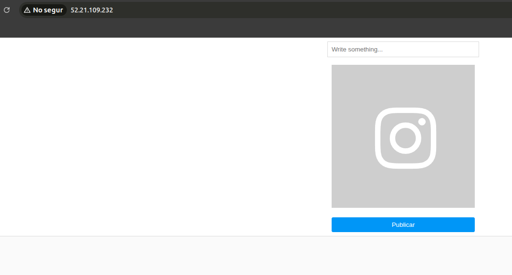

# Despliegue del servidor Web
---

## Información del hardware y networok

**Ip del Servidor Web (Apache + PHP):** 52.21.109.232

**Hostname del servidor web:** W-N04

---

### 1. Actualización del Sistema

* **Comando:**

```bash
sudo apt update && sudo apt upgrade -y

```

> Se actualizan los repositorios del sistema operativo (`apt update`) y se aplican los parches de seguridad disponibles (`apt upgrade`) para garantizar un entorno base estable y seguro.

---

### 2. Instalación del Servidor Web (Apache)

* **Comando:**

```bash
sudo apt install apache2 -y

```

* **Verificación:**

```bash
sudo systemctl status apache2

```

> Instalación del paquete `apache2`. Se verifica que el servicio está en estado `active (running)`, lo que indica que el servidor web está escuchando peticiones en el puerto 80.

---

### 3. Instalación de PHP y Librerías

Ubuntu 24.04 trae PHP 8.3 por defecto. Necesitamos instalar el núcleo de PHP y los módulos para que se hable con Apache y MySQL, y pueda procesar imágenes (vital para Extagram).

* **Comando (copia todo junto):**

```bash
sudo apt install php libapache2-mod-php php-mysql php-gd php-curl php-xml php-mbstring -y

```

**Desglose:**

* `php`: El intérprete del lenguaje.
* `libapache2-mod-php`: El puente que permite a Apache entender código PHP.
* `php-mysql`: Permite a PHP conectarse a la base de datos.
* `php-gd`: Librería gráfica necesaria para redimensionar o procesar las fotos que suban los usuarios.

---

### 5. Configuración de Permisos

* **Paso 5.1: Cambiar el propietario al grupo web:**

```bash
sudo chown -R www-data:www-data /var/www/html

```

* **Paso 5.2: Añadir al usuario 'ubuntu' al grupo web:**

```bash
sudo usermod -a -G www-data ubuntu

```

* **Paso 5.3: Dar permisos de escritura al grupo:**

```bash
sudo chmod -R 775 /var/www/html

```

> Se ajustan los permisos del directorio raíz (`/var/www/html`). Se asigna la propiedad al grupo `www-data` y se añade al usuario por defecto `ubuntu` a dicho grupo. Esto permite al equipo desplegar código mediante SFTP/SSH sin necesidad de utilizar credenciales de superusuario (root), siguiendo el principio de mínimo privilegio.

---

Para verificar que PHP funciona correctamente, crea el archivo info.php y añadele algun texto formato html:

```bash
echo "<?php phpinfo(); ?>" | sudo tee /var/www/html/info.php
```

Luego abre en el navegador:

`http://52.21.109.232`

<div align="center">
  
</div>
