# 📘 Documentación Técnica: Migración a Microservicios "Extagram"

## 1. Introducción y Justificación Estratégica

Se ha completado la transformación de "Extagram" desde una aplicación monolítica tradicional a una **arquitectura distribuida de microservicios**.

La necesidad de este cambio responde a los siguientes objetivos técnicos:

1. **Aislamiento de Responsabilidades:** Separación estricta entre la capa de presentación, lógica de negocio, almacenamiento de objetos y base de datos.
2. **Escalabilidad Horizontal:** Capacidad de añadir réplicas del backend (S2, S3) sin detener el servicio.
3. **Persistencia Robusta:** Los datos (imágenes y base de datos) sobreviven a la destrucción de los contenedores mediante volúmenes montados en el Host.
4. **Seguridad Perimetral:** Todo el tráfico es filtrado por un Gateway (S1) que gestiona SSL, ocultando la topología interna al mundo exterior.

---

## 2. Arquitectura de la Solución

El sistema opera dentro de una red virtual privada (`app-network`). Los componentes interactúan mediante resolución de nombres DNS interna proporcionada por Docker.

### 2.1 Diagrama de Topología

```mermaid
graph TD
    User((Usuario Final)) -->|HTTPS / Puerto 443| S1[S1: Gateway & Reverse Proxy]
    
    subgraph "Red Privada Docker (app-network)"
        style S1 fill:#f9f,stroke:#333,stroke-width:2px
        style S7 fill:#ccf,stroke:#333,stroke-width:2px
        
        %% Enrutamiento S1
        S1 -->|/assets| S6[S6: CDN - Static Content]
        S1 -->|/upload.php| S4[S4: Upload Service]
        S1 -->|/uploads/*| S4
        S1 -->|Balanceo Round-Robin| S2[S2: App Backend 1] & S3[S3: App Backend 2]
        
        %% Interacciones
        S2 & S3 & S4 -->|Conexión SQL| S7[(S7: MySQL Database)]
        S5[S5: Backup Worker] -.->|Dump SQL| S7
        
        %% Sistema de Archivos Compartido
        S4 ===|Escritura Física| VOL[Volumen Host: ./src/uploads]
        S2 -.->|Lectura Montada| VOL
        S3 -.->|Lectura Montada| VOL
    end

```



---

## 3. Dependencias y Requisitos del Entorno

Para replicar este despliegue se requiere:

* **SO Host:** Linux (Ubuntu 24.04 LTS recomendado).
* **Docker Engine:** v24.0+
* **Docker Compose:** v2.0+
* **Puertos Host:** 80 (HTTP) y 443 (HTTPS) libres.
* **Recursos:** Mínimo 2 vCPU y 4GB RAM. (De los cuales 2 con una partición swap)

---

## 4. Ingeniería de Servicios (Configuración Detallada)

A continuación, se detalla la configuración técnica de cada microservicio, explicando su función específica y su implementación.

### 🚪 S1: Gateway (Punto de Entrada)

**Función:** Actúa como la única puerta de enlace. Realiza terminación SSL (descarga el cifrado) y distribuye el tráfico.

* **Lógica de Enrutamiento:**
* Peticiones de subida (`upload.php`) -> Se envían a **S4**.
* Peticiones de assets -> Se envían a **S6**.
* Tráfico general -> Se balancea entre **S2** y **S3**.


**📄 Dockerfile:**
Se personaliza la imagen de Apache habilitando módulos de Proxy y SSL mediante manipulación del `httpd.conf` con `sed`.

```dockerfile
FROM httpd:2.4

# Copia de certificados y configuración
COPY ./certs/server.crt /usr/local/apache2/conf/server.crt
COPY ./certs/server.key /usr/local/apache2/conf/server.key
COPY ./conf/extagram.conf /usr/local/apache2/conf/extra/extagram.conf

# Habilitación programática de módulos necesarios
RUN sed -i \
    -e 's/#LoadModule proxy_module/LoadModule proxy_module/' \
    -e 's/#LoadModule proxy_http_module/LoadModule proxy_http_module/' \
    -e 's/#LoadModule proxy_balancer_module/LoadModule proxy_balancer_module/' \
    -e 's/#LoadModule lbmethod_byrequests_module/LoadModule lbmethod_byrequests_module/' \
    -e 's/#LoadModule ssl_module/LoadModule ssl_module/' \
    -e 's/#LoadModule socache_shmcb_module/LoadModule socache_shmcb_module/' \
    -e 's/#LoadModule rewrite_module/LoadModule rewrite_module/' \
    /usr/local/apache2/conf/httpd.conf && \
    echo "Include conf/extra/extagram.conf" >> /usr/local/apache2/conf/httpd.conf

```

**📄 docker-compose.yml:**

```yaml
version: '3'
services:
  gateway:
    build: .
    container_name: S1-gateway-https
    ports:
      - "80:80"
      - "443:443"
    networks:
      - app-network

```

**📄 Configuración Apache (extagram.conf):**

```apache
Listen 443
<VirtualHost *:80>
    ServerName localhost
    RewriteEngine On
    RewriteRule ^(.*)$ https://%{HTTP_HOST}$1 [R=301,L]
</VirtualHost>

<VirtualHost *:443>
    ServerName localhost
    SSLEngine on
    SSLCertificateFile "/usr/local/apache2/conf/server.crt"
    SSLCertificateKeyFile "/usr/local/apache2/conf/server.key"
    
    ProxyPreserveHost On
    ProxyRequests Off

    <Proxy "balancer://app-cluster">
        BalancerMember "http://app-s2:80"
        BalancerMember "http://app-s3:80"
    </Proxy>

    ProxyPass "/upload.php" "http://app-s4:80/upload.php"
    ProxyPassReverse "/upload.php" "http://app-s4:80/upload.php"
    ProxyPass "/uploads/" "http://app-s4:80/uploads/"
    ProxyPassReverse "/uploads/" "http://app-s4:80/uploads/"
    ProxyPass "/" "balancer://app-cluster/"
    ProxyPassReverse "/" "balancer://app-cluster/"
</VirtualHost>

```

---

### ⚙️ S2: Backend de Aplicación (Nodo 1)

**Función:** Procesamiento de lógica PHP. Es un contenedor "stateless" (sin estado), excepto por la conexión a volúmenes compartidos.

**📄 Dockerfile:**

```dockerfile
FROM php:8.0-apache
RUN docker-php-ext-install mysqli && docker-php-ext-enable mysqli
RUN chown -R www-data:www-data /var/www/html

```

**📄 docker-compose.yml:**
**Nota Crítica:** Observar cómo monta el volumen de uploads apuntando a la carpeta de S4 (`../S4/src/uploads`). Esto permite que S2 vea las fotos que subió S4.

```yaml
version: '3'
services:
  app-s2:
    build: .
    container_name: S2-backend-1
    networks:
      - app-network
    volumes:
      - ./src:/var/www/html
      - ../S4/src/uploads:/var/www/html/uploads

```

---

### ⚙️ S3: Backend de Aplicación (Nodo 2)

**Función:** Redundancia. Si S2 cae o está saturado, S3 atiende las peticiones gracias al balanceador de S1. Su configuración es idéntica a S2.

**📄 Dockerfile:**

```dockerfile
FROM php:8.0-apache
RUN docker-php-ext-install mysqli && docker-php-ext-enable mysqli
RUN chown -R www-data:www-data /var/www/html

```

**📄 docker-compose.yml:**

```yaml
version: '3'
services:
  app-s3:
    build: .
    container_name: app-s3
    networks:
      - app-network
    volumes:
      - ./src:/var/www/html
      - ../S4/src/uploads:/var/www/html/uploads

```

---

### 📥 S4: Upload Service (Servicio de Ingesta)

**Función:** Servicio especializado en E/S (Entrada/Salida) de archivos pesados. Se separa para no bloquear los procesos PHP de S2/S3 durante subidas lentas.

**📄 Dockerfile:**
Incluye configuración específica de `php.ini` para permitir archivos grandes (64MB).

```dockerfile
FROM php:8.0-apache
RUN docker-php-ext-install mysqli && docker-php-ext-enable mysqli
RUN chown -R www-data:www-data /var/www/html
# Optimización para cargas de archivos
RUN echo "upload_max_filesize = 64M" > /usr/local/etc/php/conf.d/uploads.ini && \
    echo "post_max_size = 64M" >> /usr/local/etc/php/conf.d/uploads.ini

```

**📄 docker-compose.yml:**
Este contenedor es el "dueño" físico de la carpeta de uploads en el host.

```yaml
version: '3'
services:
  app-s4:
    build: .
    container_name: S4-backend-upload
    networks:
      - app-network
    volumes:
      - ./src:/var/www/html
      - ./src/uploads:/var/www/html/uploads

```

---

### 💾 S5: Backup Service (Disaster Recovery)

**Función:** Contenedor efímero (Worker). Su ciclo de vida es: *Nacer -> Ejecutar Dump -> Guardar Archivo -> Morir*. No consume recursos mientras no se usa.

**📄 docker-compose.yml:**
Usa la imagen de MySQL como cliente para conectar remotamente a S7.

```yaml
version: '3'
services:
  backup-s5:
    image: mysql:8.0
    container_name: S5-backup-service
    # Script inline para realizar la copia de seguridad
    command: sh -c "mysqldump -h S7-mysql-db -u extagram_admin -pP0.1_G04 extagram_db > /backups/backup.sql && echo 'Backup OK'"
    networks:
      - app-network
    volumes:
      - ./backups:/backups

```

---

### 📦 S6: CDN (Content Delivery Network)

**Función:** Servidor HTTP optimizado (Alpine Linux) para servir exclusivamente contenido estático (CSS, JS, Logos), reduciendo la latencia y la carga en los servidores PHP.

**📄 docker-compose.yml:**

```yaml
version: '3'
services:
  cdn-s6:
    image: httpd:2.4-alpine
    container_name: S6-cdn
    volumes:
      # Montaje directo de assets
      - ./assets:/usr/local/apache2/htdocs/assets
    networks:
      - app-network

```

---

### 🗄️ S7: Base de Datos Relacional

**Función:** Persistencia centralizada de la información estructurada.

**📄 Archivo de Inicialización (`init.sql`):**
Se ejecuta automáticamente solo la primera vez que se crea el volumen.

```sql
CREATE DATABASE IF NOT EXISTS extagram_db;
USE extagram_db;

CREATE TABLE IF NOT EXISTS posts (
    post TEXT,
    photourl TEXT
);

CREATE USER IF NOT EXISTS 'extagram_admin'@'%' IDENTIFIED BY 'P0.1_G04';
GRANT ALL PRIVILEGES ON extagram_db.* TO 'extagram_admin'@'%';
FLUSH PRIVILEGES;

```

**📄 docker-compose.yml:**
Define el usuario root, base de datos por defecto, y lo más importante: un **Healthcheck**. Esto permite que los otros servicios sepan cuándo MySQL está realmente listo para recibir conexiones.

```yaml
version: '3'
services:
  mysql-db:
    image: mysql:8.0
    container_name: S7-mysql-db
    environment:
      MYSQL_ROOT_PASSWORD: root
      MYSQL_DATABASE: extagram_db
      MYSQL_USER: extagram_admin
      MYSQL_PASSWORD: P0.1_G04
      MYSQL_INITDB_SKIP_TZINFO: "yes"
    volumes:
      - mysql_data:/var/lib/mysql
      - ./init.sql:/docker-entrypoint-initdb.d/init.sql
    networks:
      - app-network
    healthcheck:
      test: ["CMD", "mysqladmin", "ping", "-h", "localhost"]
      timeout: 20s
      retries: 10
    restart: unless-stopped

volumes:
  mysql_data:
    external: true

```

---

## 5. Automatización y DevOps (Scripts)

Para garantizar la reproducibilidad del entorno, se han creado scripts Bash que gestionan la infraestructura.

### 5.1 Script de Inicialización (`boot.sh`)

Este script resuelve el problema del "huevo y la gallina" en microservicios, asegurando que:

1. La red exista.
2. Los permisos de carpeta en el Host sean correctos (`chmod 777` necesario para Docker en Linux).
3. La base de datos arranque antes que las apps que dependen de ella.

```bash
#!/bin/bash
BASE="/home/ubuntu"
echo "🚀 INICIANDO DESPLIEGUE DE EXTAGRAM..."

# 1. Crear Red
sudo docker network create app-network 2>/dev/null || true

# 2. Gestión de Directorios y Permisos (CRÍTICO)
mkdir -p $BASE/S4/src/uploads
mkdir -p $BASE/S5/backups
mkdir -p $BASE/S6/assets
sudo chmod -R 777 $BASE/S4/src/uploads
sudo chmod -R 777 $BASE/S5/backups

# 3. Base de Datos (Prioridad 1)
cd $BASE/S7 && sudo docker-compose up -d --build
echo "⏳ Esperando 25s a la inicialización de MySQL..."
sleep 25

# 4. Servicios Core
cd $BASE/S4 && sudo docker-compose up -d --build --remove-orphans
cd $BASE/S2 && sudo docker-compose up -d --build --remove-orphans
cd $BASE/S3 && sudo docker-compose up -d --build --remove-orphans
cd $BASE/S6 && sudo docker-compose up -d --build --remove-orphans
cd $BASE/S1 && sudo docker-compose up -d --build --remove-orphans

# 5. Test de Backup
cd $BASE/S5 && sudo docker-compose up --build

```

### 5.2 Script de Limpieza (`clean.sh`)

Permite un reinicio total ("Hard Reset") eliminando contenedores, redes y volúmenes persistentes.

```bash
#!/bin/bash
BASE="/home/ubuntu"
echo "☢️  INICIANDO PURGA DEL SISTEMA..."

# 1. Bajar servicios
for dir in S1 S2 S3 S4 S5 S6 S7; do
    if [ -d "$BASE/$dir" ]; then
        cd "$BASE/$dir" && sudo docker-compose down --remove-orphans 2>/dev/null
    fi
done

# 2. Limpieza forzosa
sudo docker rm -f $(sudo docker ps -aq) 2>/dev/null
sudo docker network rm app-network 2>/dev/null
sudo docker volume rm $(sudo docker volume ls -q) 2>/dev/null
sudo rm -rf $BASE/S4/src/uploads/*
sudo rm -rf $BASE/S5/backups/*
sudo docker system prune -a --volumes -f

```

---

## 6. Procedimientos de Mantenimiento

### 6.1 Instalación desde Cero

Ejecutar en la raíz del proyecto:

```bash
chmod +x boot.sh clean.sh
./boot.sh

```

### 6.2 Verificación de Salud

Comprobar que los servicios S1, S2, S3, S4, S6 y S7 están en estado `Up` y S7 `(healthy)`. S5 debe estar `Exited (0)`.

```bash
sudo docker ps -a

```

### 6.3 Backup Manual de Base de Datos

Para generar un snapshot de la base de datos en cualquier momento:

```bash
cd /home/ubuntu/S5
sudo docker-compose up --build
# El archivo aparecerá en /home/ubuntu/S5/backups/

```

### 6.4 Gestión de Logs

Para depurar errores en el balanceador o en la aplicación:

```bash
sudo docker logs -f S1-gateway-https
sudo docker logs -f S2-backend-1

```