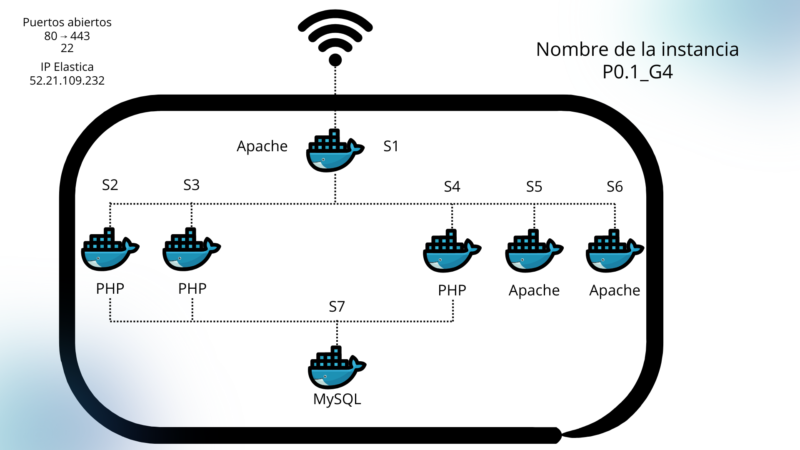

# Infraestructura final del Proyecto:

## 1. Descripción General

Para el sprint 2/3, se implementa una **arquitectura escalable con Docker** y **balanceo de carga**, evolucionando del MVP monolítico inicial. 
Apache en **S1** actúa como proxy inverso y load balancer, recibiendo todas las peticiones HTTP del navegador y distribuyéndolas inteligentemente según la ruta específica. 
Las peticions a `extagram.php` se balancean entre **S2** y **S3** (backends PHP), mientras que otros recursos se sirven desde servidores dedicados o almacenamiento persistente.

Esta topología permite **alta disponibilidad**, **escalabilidad horizontal** y **separación de responsabilidades**, ideal para producción en entornos cloud o on-premise con orquestración Docker.

## 2. Especificaciones de la Infraestructura (Docker)

Todos los componentes se despliegan como **contenedores Docker** interconectados en una **red Docker personalizada** (`extagram-net`), 
permitiendo resolución de nombres por hostname (S1, S2, etc.).

### Contenedores Principales:

**Capa de Presentación y Balanceo:**
- **S1 (Apache httpd:alpine)**: Proxy inverso con mod_proxy_balancer; recibe peticiones del navegador y balancea a S2/S3 para extagram.php.

**Aplicación Dinámica (PHP-FPM):**
- **S2 y S3 (php-fpm/app)**: Backends replicados. Procesan lógica PHP de `extagram.php` (validación/subida de imágenes, integración Telegram).

**Procesador de Uploads (PHP-FPM):** 
- **S4 (PHP/app dinámica)**: Servidor para procesamiento PHP adicional o endpoints específicos.

**Servidor de Imágenes (Apache httpd:alpine)**
- **S5 (Static Server)**: Servidor de archivos estáticos (CSS/JS/imágenes públicas).

**Assets Estáticos (Apache httpd:alpine)**
- **S6 (Static Server)**: Réplica o servidor estático complementario para CDN-like.

### Almacenamiento Persistente:
- **S7 (Database)**: Base de datos relacional (MySQL). Almacena tabla `posts`, usuarios e metadatos de imágenes.
- **Uploads Folder**: Volumen Docker montado (`/uploads/`) para persistir imágenes subidas por usuarios.

## 3. Esquema de Red y Flujo de Peticiones

**Flujo detallado:**
- **Entrada**: Browser → **S1**:80 (todas las peticiones HTTP)
- **Balanceo Dinámico**:
  - `/extagram.php` → **Round-robin S2/S3** (alta disponibilidad)
  - Rutas PHP dinámicas → **S4**
  - Archivos `.css`/`.js`/`.png` → **S5/S6**
- **Persistencia**: S2/S3/S4 → **S7** (DB) + **Uploads folder** para imágenes
- **Red Interna**: Comunicación via Docker network (puertos internos 80/3306)

## 4. Ventajas Arquitectónicas

| Característica | Beneficio |
|---|---|
| **Escalabilidad Horizontal** | Agregar réplicas S2/S3/S5 editando `upstream` en S1 |
| **Alta Disponibilidad** | Si S2 falla, S3 continúa sirviendo `/extagram.php` |
| **Separación Responsabilidades** | Estáticos (S5/S6) no sobrecargan backends PHP |
| **Gestión Docker** | `docker-compose up --scale s2=3` para auto-escala |

Esta arquitectura representa la **evolución completa** desde monolito → microservicios con balanceo, típica en proyectos ASIR de producción.
