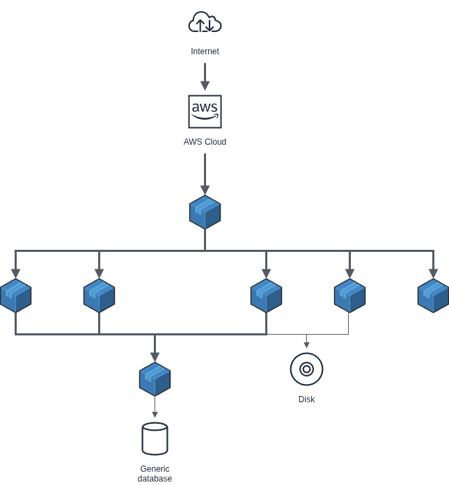

# Infraestructura final del Proyecto:

## 1. Descripción General

Para el sprint 2/3, se implementa una **arquitectura escalable con Docker** y **balanceo de carga**, evolucionando del MVP monolítico inicial. 
Apache en **S1** actúa como proxy inverso y load balancer, recibiendo todas las peticiones HTTP del navegador y distribuyéndolas inteligentemente según la ruta específica. 
Las peticions a `extagram.php` se balancean entre **S2** y **S3** (backends PHP), mientras que otros recursos se sirven desde servidores dedicados o almacenamiento persistente.

Esta topología permite **alta disponibilidad**, **escalabilidad horizontal** y **separación de responsabilidades**, ideal para producción en entornos cloud o on-premise con orquestración Docker.

## 2. Especificaciones de la Infraestructura (Docker)

Todos los componentes se despliegan como **contenedores Docker** interconectados en una **red Docker personalizada** (`extagram-net`), 
permitiendo resolución de nombres por hostname (S1, S2, etc.).

### Contenedores Principales:

**Capa de Balanceo**
- **S1 (Apache httpd:alpine)**:
  - **Balanceo de carga**  
    - Proxy inverso con `mod_proxy_balancer`; recibe peticiones del navegador y balancea a S2/S3 para `/extagram.php`.
  - **Ruteo inteligente**
    - `/upload.php` → S4
    - `/storage/` → S5
    - `/static/` → S6

**Aplicación Dinámica (PHP-FPM)**
- **S2 y S3 (php-fpm/app)**: Backends replicados. Procesan lógica PHP de `extagram.php` (validación/subida de imágenes, integración Telegram).
  - **Función** 
    - Ejecuta extagram.php
  - **Redundancia**
    - Gracias que tenemos al S1 para balancear entre ambos S2 y S3 obtendremos una alta disponibilidad y la página seguira funcionando aunque caiga un docker

**Procesador de Uploads (PHP-FPM)** 
- **S4 (PHP/app dinámica)**:
  - **Función**
    - Ejecuta unicamente el `upload.php`
    - Genera un ID único para la imagen
    - Guarda la imagen en `/uploads/[ID]`
    - Hace un insert en la BD

    
**Servidor de Imágenes (Apache httpd:alpine)**
- **S5 (Static Server)**:
  - **Función**
    - Mostrar las imagenes guardadas en la ruta `/uploads/` via `/storage/[ID]`

**Assets Estáticos (Apache httpd:alpine)**
- **S6 (Static Server)**:
  - **Función**
    - Sirve los archivos de de estilos e imagenes de la página web

### Almacenamiento Persistente:
- **S7 (Database)**: Base de datos relacional (MySQL). Almacena tabla `posts` y metadatos de imágenes.
  - **Función**
    - Almacena los posts y replica las imágenes subidas como BLOBs binarios
    - Garantiza disponibilidad si falla el sistema de archivos `/uploads/`

## 3. Esquema de Red y Flujo de Peticiones

**Flujo detallado:**
- **Entrada**: Browser → **S1**:443 (todas las peticiones HTTPS)
- **Balanceo Dinámico**:
  - `/extagram.php` → **Round-robin S2/S3** (alta disponibilidad)
  - `/upload.php` → **S4** (Procesaimiento unico de `/uploads/`)
  - `/storage/*` → **S5** (Imagenes dinámicas desde `/uploads/`)
  - `/static/`→ **S6** (CSS, SVG)
- **Persistencia Híbrida**: S2/S3/S4 → **S7** (MySQL)
- **S4** → `/uploads/` y replica automaticamente al S7
- **Red Interna**: Comunicación via Docker network (puertos internos 443/3306)

## 4. Ventajas Arquitectónicas

| Característica | Beneficio |
|---|---|
| **Escalabilidad Horizontal** | Agregar réplicas S2/S3/S5 editando `upstream` en S1 |
| **Alta Disponibilidad** | Si S2 falla, S3 continúa sirviendo `/extagram.php` |
| **Separación Responsabilidades** | Estáticos (S5/S6) no sobrecargan backends PHP |
| **Gestión Docker** | `docker-compose up --scale s2=3` para auto-escala |

Esta arquitectura representa la **evolución completa** desde monolito → microservicios con balanceo, típica en proyectos ASIR de producción.
