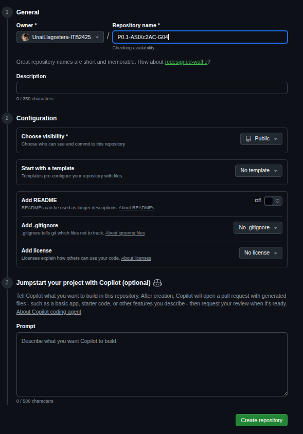
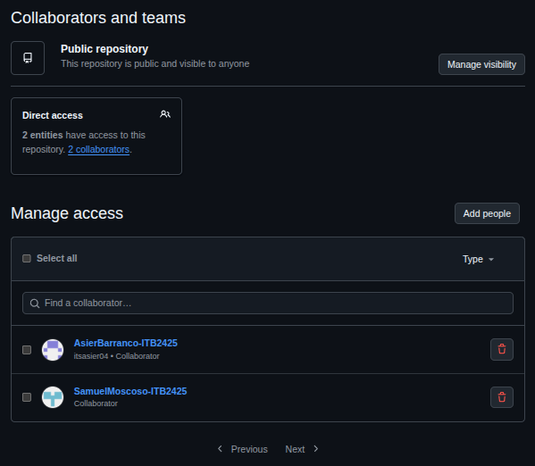

# Configuración Inicial del Repositorio GitHub

## 1. Creación del Proyecto
Antes de trabajar en local, debemos crear el contenedor remoto del proyecto.

**Pasos a seguir:**
1. Iniciar sesión en GitHub y pulsar en el botón **(+)** (esquina superior derecha) → **New repository**.
2. **Repository name:** `P0.1-ASIXc2AC-G04`.
3. **Description:** "Infraestructura de alta disponibilidad para la aplicación Extagram".
4. **Visibility:** Seleccionar **Private** (para desarrollo inicial) o **Public** según se requiera.
5. Pulsar **Create repository**.

> **Nota:** Es importante crear el repositorio vacío para evitar conflictos de historial al subir nuestro proyecto local.



---

## 2. Estructura de Directorios del Proyecto
Para mantener el orden requerido en la documentación y los recursos multimedia, organizaremos el proyecto siguiendo esta estructura estándar:

```text
P0.1-ASIXc2AC-G04/
├── docs/                      # Documentación técnica del proyecto
│   ├── configuracion/         # Archivos de configuración y variables
│   ├── despliegue/            # Guías de instalación y deploy
│   ├── informacion_previa/    # Investigación y análisis previo 
│   └── manuales/              # Guías de uso y creación/mantenimiento
├── media/                     # Recursos visuales para la documentación
│   ├── gif/                   # Animaciones de funcionamiento
│   ├── img/                   # Capturas de pantalla y diagramas
│   └── video/                 # Demos o grabaciones
└── readme.md                  # Portada/index del proyecto
```

> ❗Esta estructura puede modificarse según conveniencia del administrador/equipo dev

## 3. Gestión del Equipo (Collaborators)
Dado que Extagram es un proyecto en equipo donde todos son responsables de la totalidad del contenido, es vital dar acceso a los compañeros.

**Instrucciones:**

- Dentro del repositorio en GitHub, ir a la pestaña Settings (Configuración).

- En el menú lateral izquierdo, seleccionar Collaborators (Colaboradores).

- Clic en el botón verde Add people.

- Escribir el nombre de usuario o correo de los compañeros de equipo.

- Seleccionar el rol (normalmente "Write" o "Admin").

