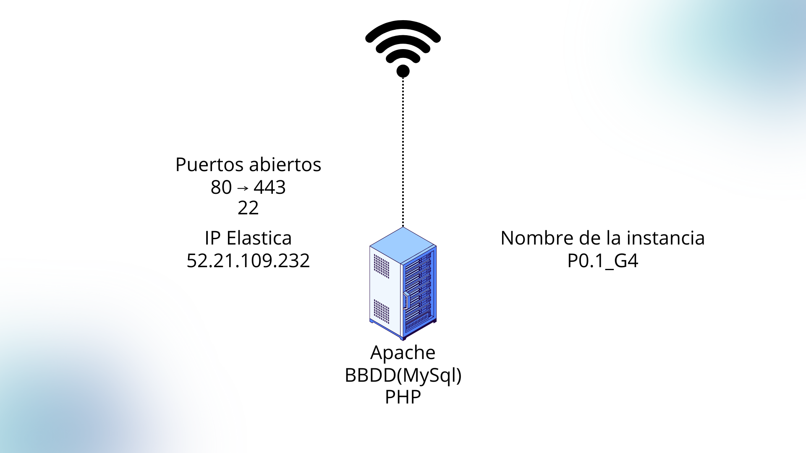

# Infraestructura inicial del Proyecto:

## 1. Descripción General
Para el primer sprint, el objetivo es establecer un **Producto Mínimo Viable (MVP)** utilizando una arquitectura **monolítica**. En lugar de separar los servicios en contenedores o múltiples servidores, todos los componentes necesarios para la aplicación *Extagram* se desplegarán y configurarán dentro de una **única instancia en AWS (EC2)**.

Este enfoque permite centrarse en la configuración base de los servicios, la validación del código PHP y la conectividad de la base de datos antes de escalar hacia una arquitectura de microservicios en los siguientes sprints.

## 2. Especificaciones de la Infraestructura (AWS)

Se aprovisionará una única máquina virtual (Instancia EC2) que alojará la pila tecnológica completa (LAMP).

* **Proveedor Cloud:** AWS (Amazon Web Services).
* **Recurso de Cómputo:** Instancia EC2 (t3.micro).
* **Sistema Operativo:** Linux (Ubuntu Server).

### Componentes de Software (Instalados en la instancia)
1.  **Servidor Web:** Apache. Actuará como punto de entrada para las peticiones HTTP.
2.  **Intérprete Backend:** PHP. Ejecuta el código de `extagram.php`. Valida que la foto sea subida correcta.
3.  **Base de Datos:** MySql Server. Instalado localmente en la misma instancia (`localhost`). Almacenará la tabla `posts` y, opcionalmente, las imágenes como BLOBs.

## 3. Esquema de Red y Seguridad

Al tratarse de un despliegue en una sola máquina, la topología de red es simplificada. No se requiere balanceo de carga ni subredes privadas complejas en esta fase.

